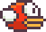
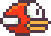
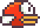
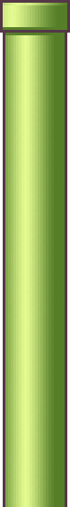

# Flappy Bird 

## Game Screenshots

### Gameplay scene

.bmp)

The game uses a pixel-art nature background with a scrolling ground layer. The bird flies through pipe gaps while the score is displayed at the top of the screen.

### Bird animation

| Frame 1 | Frame 2 | Frame 3 |
| --- | --- | --- |
|  |  |  |

The three bird frames are cycled during gameplay to create the flap animation.

### Obstacles and restart state

| Pipes | Restart button |
| --- | --- |
|  |  |

Pipes move from right to left through a gap. When the player loses, the restart button is shown so a new round can begin.

## Controls

- Click to flap.
- Press `Space` to start flying.
- Click the restart button after game over.

## Run the Game

```bash
source myenv/bin/activate
python game/Core.py
```
